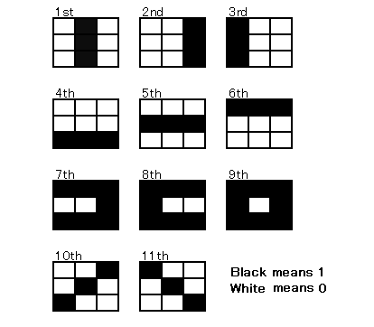
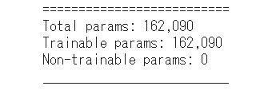
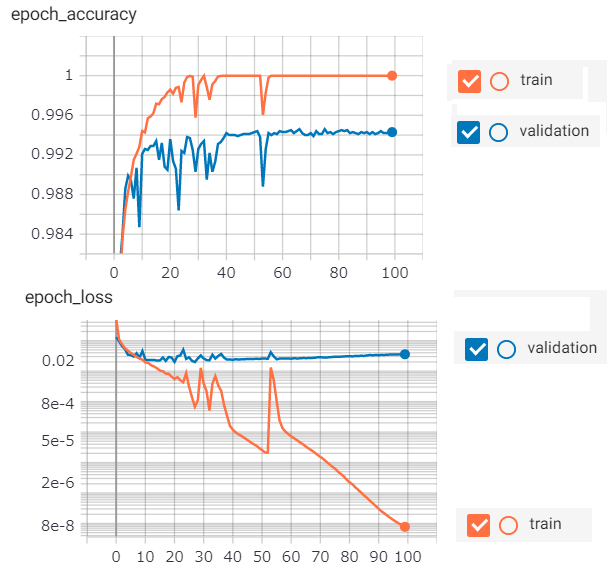
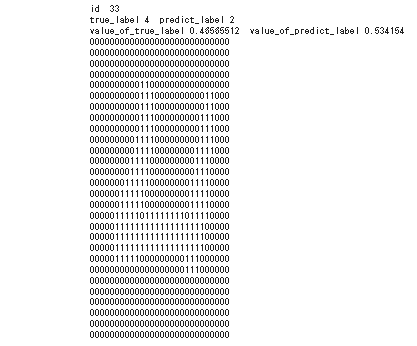
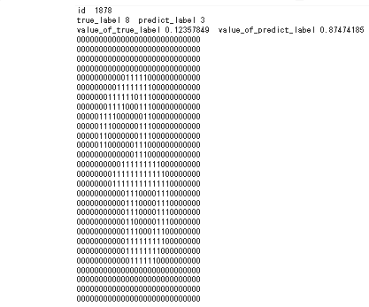
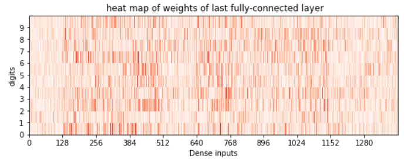

#  MNIST digits classification using 3x3 pixels basis function   

There are a lot of MNIST digits classification methods in the world.  
The feature of this method is use 3x3 pixels basis function.  
Using basis functions aims for study to control DNN.  

[github repository](https://github.com/shun60s/mnist-basis-function/)  

## Description  

Following are eleven 3x3 pixels basis functions in this method.  

  

Input image is downsized from 28x28 pixels to 3x3 pixels using CNN and MaxPooling.  
And, compute absolute value of difference from 3x3 pixels basis function per each CNN output layer,   
concatenate them and transform to 10 digits probability using one fully-connected layer.  

This network has 162090 trainable parameters.   
  

## Result  

Validation accuracy reaches up to 99.4%.  But, it may be difficult to exceed that with this method.  

  

## Incorrect prediction image sample  

Following sample are incorrect prediction image with binarization.  

  
  

## Heat map of weights  

Following shows weights of last fully-connected layer.  
1st basis function, of which Dense inputs are 0-127, seems less effective factor.  

  

## License  

MIT  

